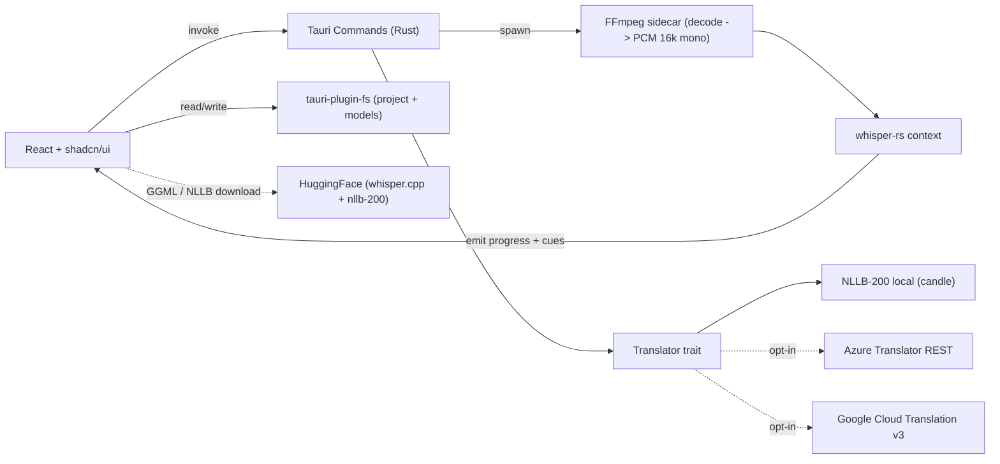

# Voxia — Phased Build Plan

A Tauri 2 desktop app for video transcription, scene-by-scene subtitle editing, and translation.

## Stack (locked)

- Shell: Tauri 2 + Rust 2021 (existing scaffold in [src-tauri/](src-tauri/))
- Frontend: React 19 + Vite 7 + TypeScript (existing scaffold in [src/](src/))
- Package manager: Bun (per [src-tauri/tauri.conf.json](src-tauri/tauri.conf.json) `beforeDevCommand`)
- UI: [shadcn/ui](https://ui.shadcn.com/) (Radix primitives + Tailwind) — components added via CLI into `src/components/ui/`; icons: `lucide-react`; appearance: **light / dark / system** via `next-themes` + shadcn CSS variables (see _Theming contract_ below)
- State / data: Zustand (UI state), TanStack Query (async/Whisper/translate), TanStack Router (typed routes)
- Transcription: `whisper-rs` (whisper.cpp Rust bindings) — fully embedded, no Python
- Audio extraction (input only): FFmpeg as a Tauri **sidecar** (one prebuilt binary per OS triple) — required because whisper.cpp cannot demux video; output stays SRT/VTT (no burn-in)
- Translation: pluggable `Translator` trait in Rust with three concrete impls — all support Mongolian (`mn`):
  - **NLLB-200 distilled-600M** (Meta, 200 langs incl. mn) running locally via [`candle-core`](https://github.com/huggingface/candle) + `tokenizers` — fully offline, default
  - **Azure Translator** (free tier 2M chars/month, user-supplied key) — REST `api.cognitive.microsofttranslator.com`
  - **Google Cloud Translation v3** (user-supplied key, paid after free trial) — REST `translation.googleapis.com`
- Persistence: `tauri-plugin-fs`, `tauri-plugin-dialog`, `tauri-plugin-store` for settings, project files written as `.voxia.json` next to the video; API keys stored in OS keyring via `tauri-plugin-stronghold` or `keyring` crate (never in plain settings)

> [!IMPORTANT]
> **Context7 usage policy (mandatory pre-step every phase)**
>
> Before writing code in a phase, resolve the library ID once and pull a focused docs snippet via the `context7` MCP. Suggested IDs / topics per phase listed inline below. Default flow:
>
> 1. `resolve-library-id` → confirm the canonical ID (e.g. `/tauri-apps/tauri`)
> 2. `get-library-docs` with a narrow `topic` (e.g. `"sidecar binaries"`, `"plugin-fs scopes"`, `"theme tokens"`)
> 3. Cache the snippet as a comment block at the top of the relevant file or in `specs/context7-notes.md`
>
> This keeps API usage current with Tauri 2.x, shadcn/ui + Tailwind, React 19, and whisper-rs releases.

## High-level architecture



## Repository conventions

- `specs/` — written before each phase: one markdown file per phase capturing decisions, schemas, and Context7 snippets (workspace rule requires checking `specs/` first).
- `src/features/<feature>/` — colocated UI + hooks + types per feature (`library`, `editor`, `models`, `translate`, `settings`).
- `src-tauri/src/<module>.rs` — one module per concern (`audio`, `whisper`, `models`, `project`, `events`, `translate/{mod,nllb,azure,google}.rs`).
- No semicolons in TS, Tailwind utility classes for layout/spacing with **semantic** shadcn tokens (`bg-background`, `text-foreground`, `border-border`, `text-muted-foreground`, etc.) and `cn()` from `@/lib/utils` — avoid raw palette hex in feature code unless necessary (e.g. waveform).
- Commit messages follow Conventional Commits.

## Theming & dark / light mode (contract)

Goal: one coherent appearance system across shell, settings, dialogs, and the video/editor surfaces, with **light**, **dark**, and **system** (follow OS) modes.

**Tailwind**

- Set `darkMode: ['class']` in `tailwind.config` so dark styles activate when the root has the `dark` class (not media-query-only), matching shadcn and `next-themes`.

**shadcn / CSS variables**

- Keep the generated global theme map in `src/index.css` (or equivalent): `:root { ... }` for light and `.dark { ... }` for dark HSL variables (`--background`, `--foreground`, `--primary`, `--card`, `--destructive`, radius, etc.). Adjust **primary** / **radius** once for brand; do not fork per-component hex colors.
- All new UI uses semantic utilities so components automatically track the active theme.

**next-themes**

- Wrap the app (inside the router root, outside routes) with `ThemeProvider` from `next-themes`: `attribute="class"`, `defaultTheme="system"`, `enableSystem={true}`, `storageKey="voxia-ui-theme"` (or another fixed key documented in `specs/`).
- Optional: `disableTransitionOnChange` to reduce jarring transitions when switching themes.
- `suppressHydrationWarning` on `<html>` if the stack warns on theme class mismatch during first paint (common with theme providers).

**Persistence vs DOM (single user story)**

- Persist `theme: 'light' | 'dark' | 'system'` in `useSettingsStore` + `tauri-plugin-store` (Phase 1) so theme survives reinstalls of the webview cache and stays with other settings.
- On store rehydration, run `setTheme(storedTheme)` from `next-themes` once (e.g. small `ThemeSync` component with `useLayoutEffect`) so the `dark` class and stored value never diverge. **After Phase 1, treat plugin-store as authoritative** if it disagrees with `next-themes` local cache from `storageKey`.
- Any UI that changes appearance (header toggle, Settings) must call **`setTheme`** and **update the Zustand field** in the same handler.

**FOUC / first paint**

- Before async settings load, `defaultTheme="system"` already gives a reasonable class from OS preference; document in `specs/` if you add an inline boot script later for zero-flash (advanced).

**Native window chrome (optional polish)**

- In Phase 8, consider Tauri `Window::set_theme` (where supported) when `resolvedTheme` is light vs dark so titlebar / traffic lights match the UI.

**Specs**

- Record chosen primary hue, radius, and `storageKey` in `specs/00-overview.md` or `specs/03-theming.md`.

---

## Phase 0 — Foundations & specs

Goal: turn the bare Tauri+React template into a typed, themed shell with the right plugins wired in. No feature code yet.

Tasks:

- Create `specs/` with `00-overview.md`, `01-data-model.md`, `02-context7-notes.md`, and `03-theming.md` (tokens, `storageKey`, and light/dark/system behavior).
- Bun-add deps: `@tanstack/react-query`, `@tanstack/react-router`, `zustand`, `tailwindcss`, `postcss`, `autoprefixer`, `class-variance-authority`, `clsx`, `tailwind-merge`, `lucide-react`, `next-themes`, `react-hook-form`, `@hookform/resolvers`, `zod`. Initialize Tailwind (`tailwind.config`, `postcss.config`, `src/index.css` with `@tailwind` layers), then `bunx shadcn@latest init` (style: New York or Default per team taste; base color aligned with app brand). Add starter components as needed in later phases (`button`, `input`, `label`, `card`, `form`, `dropdown-menu`, `toggle-group`, etc.).
- Cargo-add: `tauri-plugin-fs`, `tauri-plugin-dialog`, `tauri-plugin-store`, `tauri-plugin-shell` (for sidecar), `tauri-plugin-log`, `serde`, `tokio = { features = ["full"] }`, `thiserror`, `anyhow`.
- Register plugins in [src-tauri/src/lib.rs](src-tauri/src/lib.rs) and grant minimal scopes in [src-tauri/capabilities/default.json](src-tauri/capabilities/default.json).
- Configure Tailwind `darkMode: ['class']` and ensure `content` globs cover `src/**/*.{ts,tsx}`.
- Wrap the app in `ThemeProvider` from `next-themes` in [src/main.tsx](src/main.tsx) (or `App.tsx`): `attribute="class"`, `defaultTheme="system"`, `enableSystem`, documented `storageKey`; put `className` on `<html>` / `<body>` using `bg-background text-foreground min-h-screen antialiased` so the window background matches the theme immediately.
- Add shadcn `dropdown-menu` (or `toggle-group`) and a minimal **`ModeToggle`** in the shell placeholder that cycles or selects light / dark / system via `useTheme().setTheme`.
- Strict TS: `"strict": true`, `"noUncheckedIndexedAccess": true` in [tsconfig.json](tsconfig.json).

> [!TIP]
> **Context7:** `/tauri-apps/tauri` topic `"v2 plugin permissions"`; resolve shadcn/ui docs library ID (e.g. `ui.shadcn.com` / shadcn registry) topics `"theming"`, `"dark mode"`, `"theming tailwind"`; resolve-library-id for `next-themes` → topic `"ThemeProvider"` or `"class"`; `/tanstack/router` topic `"file-based routing setup"`.

> [!NOTE]
> **Verification:**
>
> - `bun run tauri dev` opens a themed shell with a route `/` rendering e.g. `<h1 className="text-2xl font-semibold tracking-tight">Voxia</h1>` inside a shadcn `Card` or bare layout.
> - **ModeToggle** switches light ↔ dark ↔ system and the `dark` class on `<html>` updates; shadcn components (Card, Button) visibly change surface and text contrast.
> - `bun run build` is clean.

## Phase 1 — App shell, routing, settings store

Goal: navigable shell with three top-level routes and a persisted settings store.

Tasks:

- Routes: `/library` (project list), `/editor/$projectId`, `/settings`.
- Layout: app shell built from shadcn primitives — collapsible sidebar (`Sheet` on narrow widths or a custom `aside` with `Button` toggle), top bar with app version (`Separator` + `Badge` as needed), shared **`ModeToggle`** component in the header, scrollable `main` content area using `bg-background`.
- Zustand `useSettingsStore` persisted via `tauri-plugin-store` (`theme: 'light' | 'dark' | 'system'`, default translator provider id, default source/target language with `mn` preselected, models dir override). API keys live in OS keyring, never in this store.
- **`ThemeSync`**: after plugin-store rehydration, call `setTheme(settings.theme)` once so `next-themes` matches disk; subscribe to theme changes from Settings/header so store and DOM stay aligned.
- Settings page: **Appearance** section with shadcn `RadioGroup` or `Select` for theme + form bound to the rest of the store with shadcn `Form` (react-hook-form + `@radix-ui/react-label`) + `Switch` + `Input` + `Select`.

> [!TIP]
> **Context7:** `/tauri-apps/plugins-workspace` topic `"plugin-store usage"`; `/pmndrs/zustand` topic `"persist middleware"`; resolve-library-id for `next-themes` → topic `"useTheme"` or `"setTheme"`; shadcn/ui topic `"form"` or `"react-hook-form"`.

> [!NOTE]
> **Verification:** settings survive an app restart; theme choice survives restart and matches immediately after launch; toggling in Settings and in the shell header both stay in sync.

## Phase 2 — Video import & playback

Goal: open a video file, render it, and persist a project file.

Tasks:

- `Library` page action `New project` → `tauri-plugin-dialog` `open` (filters: mp4, mov, mkv, webm, wav, mp3).
- Rust command `create_project(video_path)` writes `<video>.voxia.json` (schema in `specs/01-data-model.md`): `{ id, videoPath, createdAt, cues: [], language?, modelId? }`.
- `EditorPage` reads the project; uses HTML5 `<video>` (file URL via `convertFileSrc`) as the player inside a surface using semantic tokens (`bg-muted/30`, `border-border`) so light/dark both look intentional; `usePlayerStore` (Zustand) tracks `currentTimeMs`, `playing`, `duration`.
- Custom transport bar (shadcn `Slider` + `Button`s for play / +/- 5s / +/- frame).

> [!TIP]
> **Context7:** `/tauri-apps/tauri` topic `"convertFileSrc and asset protocol"`; `/tauri-apps/plugins-workspace` topic `"plugin-fs scope patterns"`.

> [!NOTE]
> **Verification:** video plays, scrubbing updates `currentTimeMs`, `.voxia.json` is created/loaded.

## Phase 3 — Model manager (Whisper + NLLB share one downloader)

Goal: a generic model registry/downloader used by both Whisper (Phase 4) and NLLB (Phase 6). Models live in `appDataDir/models/{whisper,nllb}/`.

Tasks:

- Rust enum `ModelKind { Whisper, Nllb }` with a typed catalog:
  - Whisper: `tiny`, `base`, `small`, `medium`, `large-v3`, plus `*-en` variants — HuggingFace URLs from `ggerganov/whisper.cpp`, GGML format.
  - NLLB: `nllb-200-distilled-600M` (default) and `nllb-200-distilled-1.3B` (optional, higher quality) — `safetensors` weights + tokenizer + sentencepiece from `facebook/nllb-200-distilled-600M`.
- Rust command `download_model(kind, id)` streams files with `reqwest` + `tokio::fs`, emits `model://progress/<kind>/<id>` events, validates SHA256, supports resume via HTTP `Range`.
- Rust command `list_models()` returns `{ whisper: [...], nllb: [...] }` with installed flag and on-disk size.
- UI: `Settings -> Models` page split into two shadcn `Tabs` (Whisper / Translation) — each tab is a `Table` (shadcn table + TanStack Table optional) with a `Progress` column; React Query `useMutation` per row with `onProgress` from a Tauri event listener.
- First-run UX: if no Whisper model is installed, the Library page shows a "Download recommended model" prompt (`base` or `small`).

> [!TIP]
> **Context7:** `/tauri-apps/tauri` topic `"emit and listen events"`; `/seanmonstar/reqwest` topic `"streaming download with range"`; `/tanstack/query` topic `"mutations with progress"`.

> [!NOTE]
> **Verification:** a `tiny` Whisper model (~75 MB) and the `nllb-200-distilled-600M` (~2.5 GB) both download, appear in their tabs, and survive restart; killing and resuming a partial NLLB download finishes correctly.

## Phase 4 — Transcription pipeline (whisper-rs)

Goal: produce a cue list from the video using the chosen model, fully offline.

Tasks:

- Cargo-add `whisper-rs` (enable `metal` on macOS, `cuda` feature behind a build flag).
- Rust module `audio.rs`: spawn FFmpeg sidecar with args `-i <video> -ac 1 -ar 16000 -f f32le -` and read stdout into a `Vec<f32>` (chunked, with a soft memory cap; use a temp WAV for very long files).
- Rust module `whisper.rs`: load `WhisperContext` once per `(modelPath, lang)`, run `full(params, samples)`, iterate segments → `Cue { id, start_ms, end_ms, text }`.
- Long-running task spawned with `tokio::task::spawn_blocking` (whisper.cpp is CPU-heavy and not async-safe); progress emitted as `transcribe://progress` (percent + last segment text).
- Sidecar config: add `externalBin` entry in [src-tauri/tauri.conf.json](src-tauri/tauri.conf.json) and ship `ffmpeg-x86_64-apple-darwin`, `ffmpeg-aarch64-apple-darwin`, `ffmpeg-x86_64-pc-windows-msvc.exe`, `ffmpeg-x86_64-unknown-linux-gnu` in `src-tauri/binaries/`. Permission added in `capabilities/default.json` for `shell:allow-execute`.

> [!TIP]
> **Context7:** `/tauri-apps/tauri` topic `"sidecar / externalBin"`; `tazz4843/whisper-rs` (resolve via `resolve-library-id`) topic `"WhisperContext usage"` and `"segment iteration"`; `/tokio-rs/tokio` topic `"spawn_blocking"`.

> [!NOTE]
> **Verification:** a 1-minute clip produces ≥1 cue; cancelling the task aborts the worker (`CancellationToken`); progress UI ticks smoothly.

## Phase 5 — Scene-by-scene subtitle editor

Goal: a productive editor where each cue is a "scene" the user can navigate, edit, split, merge, retime.

Tasks:

- Bun-add `@tanstack/react-virtual` for the cue list viewport.
- Component `CueList` virtualized via `@tanstack/react-virtual` (aligns with Router/Query) — each row: `#`, `start`, `end`, `text`, row actions.
- Click row → `seek(start_ms)` and `pause`. `Space` toggles play, `J/K/L` rewind/pause/forward, `Enter` splits at `currentTimeMs`, `Backspace` merges with previous, `Tab` advances cue.
- Inline edit: shadcn `Textarea` with controlled `rows` / auto-grow via `useLayoutEffect` or a small hook; commit on blur with optimistic update via `useMutation`.
- Time editing: dual numeric inputs (`hh:mm:ss.mmm`), validated against neighbors.
- Optional waveform strip: `wavesurfer.js` bound to the same audio file (extracted once in Phase 4 and cached).
- Autosave: debounced 500 ms, write back to `.voxia.json`.
- Undo/redo: lightweight command stack inside `useEditorStore` (Zustand) — last 100 ops.

> [!TIP]
> **Context7:** shadcn/ui topic `"textarea"`; `/tanstack/react-virtual` topic `"virtualizer"`; `/wavesurfer-js/wavesurfer.js` topic `"regions plugin"` (only if waveform is included in MVP).

> [!NOTE]
> **Verification:** split + merge produce contiguous timecodes with no gaps/overlaps; undo restores prior cue exactly.

## Phase 6 — Translation (pluggable, Mongolian-capable)

Goal: translate one cue, a selection, or the whole project through a provider abstraction so we can swap backends without touching the UI. The MVP ships three providers; **NLLB-200 local is the default** because it works fully offline and matches the Whisper philosophy. Mongolian (`mn`) is a first-class supported language across all three.

### Provider abstraction (Rust)

```rust
#[async_trait]
pub trait Translator: Send + Sync {
    fn id(&self) -> &'static str;          // "nllb" | "azure" | "google"
    fn supports(&self, src: Lang, tgt: Lang) -> bool;
    async fn detect(&self, text: &str) -> Result<Lang>;
    async fn translate_batch(
        &self,
        items: &[String],
        src: Lang,
        tgt: Lang,
        progress: &dyn Fn(usize, usize),
    ) -> Result<Vec<String>>;
}
```

Registered providers live in a `TranslatorRegistry` keyed by id and selected per-project (default from settings).

### Tasks

- Rust module `translate/mod.rs` — trait, `Lang` enum (BCP-47 with mapping to NLLB's FLORES-200 codes, e.g. `mn` → `khk_Cyrl` for Khalkha Mongolian Cyrillic; expose this in Settings so users on traditional script can pick `mon_Mong`).
- Rust module `translate/nllb.rs`:
  - Load NLLB-200 distilled weights (safetensors) with `candle-core` + `candle-transformers` (`m2m100` / `nllb` arch); tokenizer via `tokenizers` crate + sentencepiece model file.
  - Run inference in `tokio::task::spawn_blocking` (CPU/Metal/CUDA via candle features); batch up to 8 cues per forward pass to amortize cost.
  - Lazy-load the model on first use; keep it in a `tokio::sync::Mutex<Option<NllbModel>>` so subsequent calls reuse it.
- Rust module `translate/azure.rs`:
  - POST `https://api.cognitive.microsofttranslator.com/translate?api-version=3.0&from={src}&to={tgt}` with header `Ocp-Apim-Subscription-Key`, JSON body `[{ "Text": ... }]`. Batch up to 100 strings per request (Azure limit).
- Rust module `translate/google.rs`:
  - POST `https://translation.googleapis.com/v3/projects/{project}/locations/global:translateText` with OAuth bearer or API key. Batch per request.
- API-key storage: `keyring` crate (`keyring = "3"`) writing to OS keyring; commands `set_provider_key(provider, key)` / `clear_provider_key(provider)` / `has_provider_key(provider)` (returns bool only — never the key itself).
- Tauri command `translate_cues(projectId, providerId, src, tgt)` that:
  1. Loads cues from `.voxia.json`,
  2. Sends them to the chosen provider in batches with a rate-limited concurrency window (NLLB: 1 batch in flight, Azure/Google: 4),
  3. Emits `translate://progress` `{ done, total, lastText }` events,
  4. Writes `translatedText` back into each cue.
- Frontend:
  - `useTranslationStore` (Zustand): `provider`, `sourceLang` (default `auto`), `targetLang` (default `mn` / `khk_Cyrl`).
  - Editor toolbar: provider picker (`ToggleGroup` or a row of shadcn `Toggle` / `Button` variants — shadcn has no `Segmented` analogue), source/target language `Select` with the full NLLB language list grouped by script, `Translate selected` and `Translate all` buttons.
  - Per-cue `Translate` icon button on each row.
  - Bilingual view toggle: cell renders original on top, translation below.
  - Settings → Translation tab: pick default provider, manage Azure / Google API keys (masked input, `Save` writes to keyring, `Test` runs a 3-word probe and shows latency + char count).
- Error handling: provider-specific errors mapped to a uniform `TranslateError { kind: NetworkUnavailable | AuthFailed | RateLimited | UnsupportedPair | ModelNotInstalled | Unknown(String), retryable: bool }`. UI shows a toast (e.g. shadcn `Sonner`) with retry action; `RateLimited` triggers exponential backoff inside the batch driver.

> [!TIP]
> **Context7:** `/huggingface/candle` topic `"nllb-200 / m2m100 inference example"`; `/huggingface/tokenizers` topic `"sentencepiece + special tokens"`; `/seanmonstar/reqwest` topic `"json post with bearer auth"`; `/tanstack/query` topic `"mutations with progress"`. Search: "Azure Translator REST translate v3.0"; "Google Cloud Translation v3 REST translateText".

> [!NOTE]
> **Verification:**
>
> - `Translate all` of a 200-cue project completes on each provider; NLLB runs entirely with the network disabled.
> - `mn` round-trip: English → Mongolian renders correct Cyrillic glyphs in the editor and in the exported SRT.
> - API keys never appear in `tauri-plugin-store` or in logs (grep + manual log inspection).
> - Switching provider mid-project does not corrupt previously translated cues.

## Phase 7 — Export SRT / VTT

Goal: produce industry-standard subtitle files. No video re-encoding.

Tasks:

- Rust pure functions `to_srt(cues, mode)` and `to_vtt(cues, mode)` where `mode = Original | Translated | Bilingual`.
- Tauri command `export_subtitles(projectId, format, mode, path)` using `tauri-plugin-dialog` `save`.
- Property tests in Rust verifying timecode formatting (`HH:MM:SS,mmm` for SRT, `HH:MM:SS.mmm` for VTT) and round-trip parse via a small parser used in tests only.
- UI: shadcn `Dialog` with format/mode pickers, preview of first 5 cues.

> [!TIP]
> **Context7:** `/tauri-apps/plugins-workspace` topic `"plugin-dialog save"`; SRT/VTT specs are stable so Context7 not needed here.

> [!NOTE]
> **Verification:** exported `.srt` opens in VLC and mpv with correct timing; bilingual mode shows two lines per cue.

## Phase 8 — Polish, packaging, distribution

Tasks:

- App icons (replace defaults in `src-tauri/icons/`).
- Optional: sync **native window theme** (`Window::set_theme` / platform equivalent) with `resolvedTheme` from the frontend so OS titlebar matches light/dark UI.
- Logging: `tauri-plugin-log` writing to `logs/voxia.log` with rotation; in-app log viewer in Settings.
- Auto-updater: `tauri-plugin-updater` with a JSON manifest, signing keys generated and `.gitignore`d.
- Build matrix: macOS (universal `.dmg`), Windows (`.msi`), Linux (`.AppImage`); GitHub Actions workflow `ci.yml` running `bun run build` + `cargo test` + `cargo clippy -- -D warnings`.
- README rewrite (replace [README.md](README.md)) describing user flow, Whisper + NLLB model download, and how to add Azure / Google API keys.

> [!TIP]
> **Context7:** `/tauri-apps/plugins-workspace` topic `"plugin-updater signing"`; `/tauri-apps/tauri-action` topic `"matrix build"`.

> [!NOTE]
> **Verification:** signed update from `0.1.0 -> 0.1.1` applies on macOS and Windows; CI is green.

## Phase 9 — Stretch (post-MVP, optional)

- Burn-in export via FFmpeg sidecar (`-vf subtitles=...`).
- Diarization (speaker labels) via `pyannote` ONNX or `whisper.cpp` `--diarize`.
- Additional `Translator` impls: DeepL, MyMemory, Yandex, on-device M2M-100 quantized.
- Translation memory + glossary (per-project terminology, biased toward Mongolian transliteration rules).
- Project library backed by SQLite via `tauri-plugin-sql`.

## Cross-cutting "corrections" checklist (run at the end of every phase)

1. `cargo clippy --all-targets -- -D warnings` and `cargo fmt --check`.
2. `bun run tsc --noEmit` and `bun run build`.
3. Smoke test on macOS dev build.
4. Update the matching `specs/<phase>.md` with any deviations.
5. Conventional commit, e.g. `feat(editor): add cue split on Enter`.
6. Refresh the relevant Context7 snippet if the upstream lib released a new version during the phase.
7. Quick theme pass: open light, dark, and system (with OS set to opposite) — no unreadable text, no hardcoded white/black panels outside the video frame itself.
